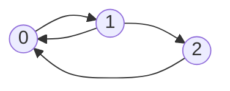

<style type="text/css">
   {
    text-align: center;
	
}

.center img {
    display: block;
    margin: 0 auto;
	width:80%;
}

</style>
## Definition


>A computer system with the incoming rate of customers each of which having a due time and a queue that they can wait on. 
The customers will be blocked and droped if the queue is full.
The customers whose the due time reachs, would be droped aswell.
the rest would be serviced and considered as repartured.
assuming customers arrival is a poisson process or with a normal distribution, we try to simulate this queue and find out the percentage of blockage and departure ratio.
In addition we compare the results of simulation with the analytical results.
If the simulation is successfull, the differece shouldn't be that much.


### **Algorithm Description**

Each new edge out of `m0` for new node, with probablity of `(1-p)` connects to a random node and with `p` connect to an old neighbor of randomly selected vertex. which means either the new destination is and old destination of some node or it is compeletly random.
### Step1. for each of m0 edge, throw a coin to decide what should we do next:

```python
    rnd_node=random.randrange(0,new_node)
    old_neighbors=set([y for (x,y) in edges if x==rnd_node ])
    all={y for y in range(new_node)}
    for i in range(m):
        prob=random.uniform(0, 1)
```
### Step2. **choose** either a random or old neighbor depending the outcome of previous step  :
```python
    if (prob<p and len(old_neighbors)>0):
        new_dest=random.choice(list(old_neighbors))
        .
        .
        .
    else:
        if (len(all)==0):
            continue
        new_dest=random.choice(list(all))
        .
        .
        .
        .

```

### Step3. connect the edges and discard the choosen one

```python
    edges.append((new_node,new_dest))
    edges.append((new_dest,new_node))
    deg_dict[new_node]+=1
    deg_dict[new_dest]+=1
    old_neighbors.discard(new_dest) 
    all.discard(new_dest) 
```
The implemented algorithm is based on [kleinburg-kumar Vertex copying model](https://en.wikipedia.org/wiki/Copying_mechanism)
### **Degree Distribution Result**

The model started from below seed graph:

The degree distribution as it can be guessed is decreasing for higher deegres and is said that the distribution follows power law distribution. The interesting point as shown in chart, is that the when the probablity of old neighbors increases, the apearence of higher degrees is more likely to happen.
{:class="img-responsive"}
{: .center}
both results are based of multiple experiments to form consistent deegre frequence and the avarage of them is showing. As it can be seen the number of nodes doesn't affect the form of the network structure, thats why they called it free scale model.
{:class="img-responsive"}
{: .center}
[Full code here](https://github.com/Dowlatabadi/HWs/blob/master/SN/copying.py)


