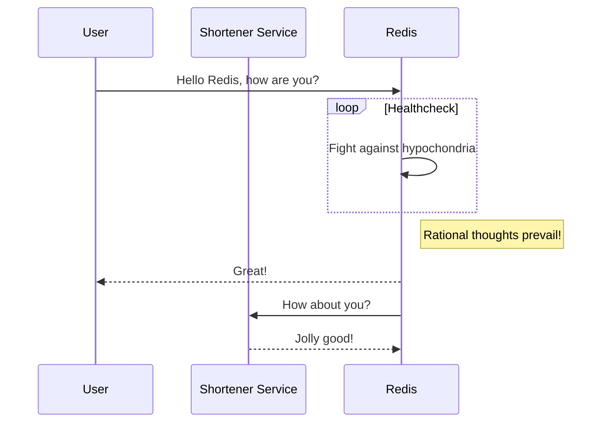
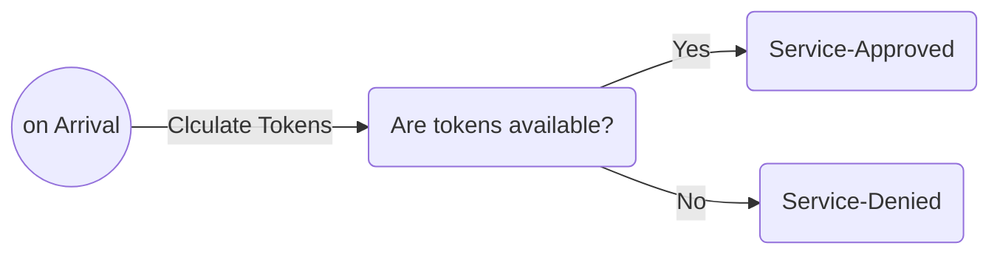

<style type="text/css">
   {
    text-align: center;
	
}

.center img {
    display: block;
    margin: 0 auto;
	width:80%;
}

</style>
## Problem Definition


>Sometimes we want to shorten the input or just we need to compress a string in a one-way process for example creating gift codes, Shortening the links and so on.

> The one-way approach is desired because we want to find a way to relate a small string (**compressed version**) to be a representation of the **original version**.
This link should be maintained by a storage mechanism like databases. The search can be enhanced by choosing a function that accepts the original version as a variable and the output differs when the input differentiates. The reason is instead of searching based on the whole link and user identification, we only need to search based on the compressed version, which is easier to be index due to its small required space.
And this search only happens when we want to generate shortened version, that time we need to check if the link is already there, hence a seach would be needed based on the original version or the compact one which happens by using random generation and one-way copressing function respectively.


System Sequence Diagram:


## Solution

The **trivial solution** is to define a back-off time between 2 batches of requests, but it has two main problems: 
- The rate can exceed the limit 
- Even by choosing slots little enough, still, the issue might remain or might result in another performance problem.


The rate-limiting problem is not a new problem. There are many solutions but the **token bucket algorithm** is a simple solution that would be investigated in this post.


### Algorithm Description

The **actual algorithm** is more like **discrete event simulation**; such that in each occurrence of events we decide for the new state of the system. The main event is: *the request arrival*.
in which we first add newly generated tokens within the gap between last token usage and now.

Then we investigate for required tokens(units that show the ability to execute one request). Therefore the decision can be to discard the request or pass it to the service.


If the total requests for the users should be limited, we can use a cached HashSet for the user's tokens, and last req timestamp, and the limit value.

Rate Limiter Logic:



### on Request Arrival

```python
    def RefillandExamine(user,request_tokens):
        #refill
        now=Datetime.time
        current_tokens=current_tokens+(now-last_timestamp)*fill_rate
        #decision point
        if (current_tokens>=request_tokens):
            current_tokens-=request_tokens
            pass_requests()
        else:
            discard_request()

```


In a distributed system we still can calculate the sum of requests, but to ensure we have enough tokens in each bucket, we assign `N*required_tokens` to overall nodes but after each event we clear exessive tokens. In this case, we need to inform nodes about each other that it can be achieved by using fully mesh broadcasting, **Gossip Communication**, **Distributed Cache**, or **Leader Election** and coordination methods.


In this situation, we risk the consumption of excessive tokens, but it can be fixed.


