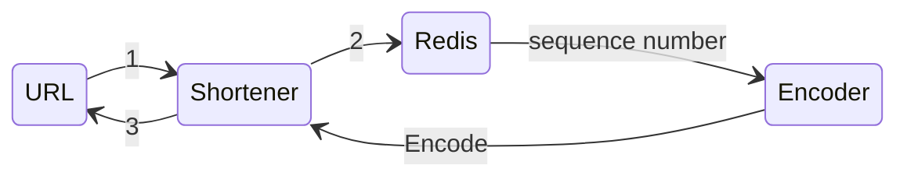
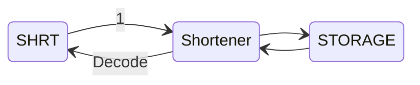

<style type="text/css">
   {
    text-align: center;
	
}

.center img {
    display: block;
    margin: 0 auto;
	width:80%;
}

</style>
## Problem Definition


>Sometimes we want to shorten the input or just we need to compress a string in a one-way process for example creating gift codes, Shortening the links and so on.

## Solution
The one-way approach is desired because we want to find a way to relate a small string (**compressed version**) to be a representation of the **original version**.
This link should be maintained by a storage mechanism like databases. The mapping process is needed to be collision free, therefore we need to generate an unique Id for each link. with the help of UID generation methods like, hirearchial generation, sharding like sequence generation and other methods, we can generate the Id, now the question is how to decode this Id to a short version.
The solution is depending on the length of desired short version, we ca use a base conversion method with the provided allowed characters.

Now let's take another look to the whole requirements:

get method: short -> original link
post method: original link -> short

after generation a sequence number with the help of a thread safe counter or a distributed db system, we convert it to the short form and no longer need the seque number itsef.

Now we have pair of (short and original link)s, wich is enough to create our system based on.





### Encoding Algorithm (base conversion):

```python
    alph='ABCDEFGHIJKLMNOPQRSTUVWXYZ'
    alph_dict={x:i for i,x in enumerate(alph)}

    def encode(input_int):
        res=[]
        if input_int==0:
            return alph[0]
        while input_int>0:
            r=input_int%(len(alph))
            res.append(alph[r])
            input_int//=len(alph)
        return ''.join(reversed(res))

```


### Decoding Algorithm:
well, decoding is not required at all, because we don’t need to find the original sequence number.

Further, we store key/values and the reverse of them in DB.

**Note**: We used Redis increment capability to generate a unique sequence numbers.


### Scaling
Usually, when the number of **Requests per second** increases, one instance of the service because of the sequential processing which can be improved by multithreading or concurrent paradigms, wouldn’t result in good throughput or success ratio. while these approaches can improve the performance, the simpler solution could be using multiple instances of the service instead of only one. this can be done by the use of containerizing approaches like docker, and scaling can be controlled by docker swarm and so on.

The provided code has a benchmarking system and a docker-compose file ready to be used for the docker swarm. more instruction is available in the repository:


[Shotener Repository](https://github.com/Dowlatabadi/Shrtnr "Shotener's Homepage")


